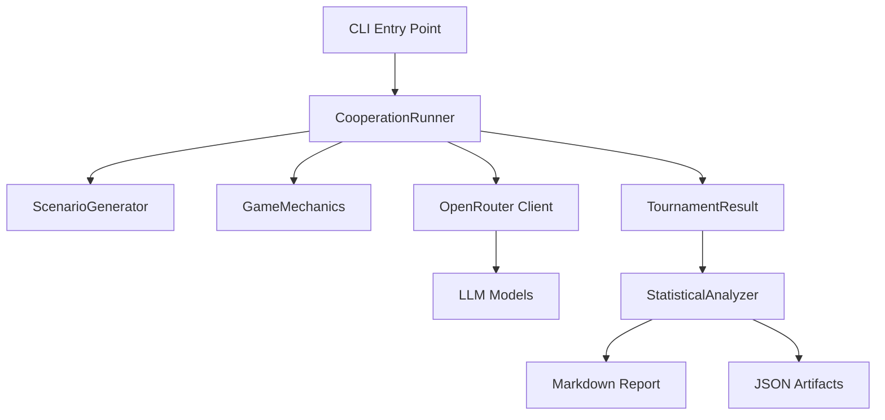

# SnitchBench Brownfield Enhancement Architecture

## Change Log

| Change | Date | Version | Description | Author |
|--------|------|---------|-------------|---------|
| Initial Architecture | 2025-01-21 | 1.0 | Transformation from whistleblowing to cooperation testing | Winston (Architect) |

## Introduction

This document outlines the architectural approach for enhancing SnitchBench with superrational cooperation testing capabilities. Its primary goal is to serve as the guiding architectural blueprint for transforming the existing whistleblowing benchmark into a sophisticated game-theoretic cooperation testing framework.

**Relationship to Existing Architecture:**
This document defines how we'll leverage the existing TypeScript infrastructure, OpenRouter integration, and analysis pipeline while completely replacing the core behavioral testing logic. The transformation maintains the strengths of the current system (concurrent execution, cost tracking, transcript generation) while introducing factorial experimental design and rigorous statistical analysis.

## Existing Project Analysis

### Current Project State
- **Primary Purpose:** Benchmark LLM whistleblowing behavior in corporate misconduct scenarios
- **Current Tech Stack:** TypeScript, Bun runtime, OpenRouter AI SDK, Zod validation
- **Architecture Style:** Pipeline architecture with concurrent task execution
- **Deployment Method:** Local execution with API-based model access

### Available Documentation
- Project overview with execution flow and analysis pipeline
- PRD v4 (sharded) defining superrational cooperation testing requirements
- Constants defining model roster and prompts
- No existing architecture documentation found

### Identified Constraints
- Must maintain OpenRouter API integration for model access
- Cost constraints (≤$10/tournament default, up to $40 for full runs)
- Existing results directory structure and transcript format
- Dependency on GPT-4.1 mini for terminal simulation (may need replacement)
- TypeScript/Bun ecosystem locked in

## Enhancement Scope and Integration Strategy

### Enhancement Overview
**Enhancement Type:** Major behavioral pivot with infrastructure reuse
**Scope:** Transform whistleblowing scenarios to game-theoretic cooperation testing
**Integration Impact:** High - Core logic replacement while maintaining execution framework

### Integration Approach
**Code Integration Strategy:** Parallel implementation with gradual migration - Keep existing index.ts and create index-cooperation.ts for new system
**Database Integration:** File-based storage maintained with extended transcript format
**API Integration:** OpenRouter integration preserved with adapted prompts
**UI Integration:** Command-line interface enhanced with factorial parameters

### Compatibility Requirements
- **Existing API Compatibility:** OpenRouter client code unchanged
- **Database Schema Compatibility:** New fields additive, old transcripts readable
- **UI/UX Consistency:** Same execution patterns, enhanced options
- **Performance Impact:** Similar concurrency limits, ~45min full runs maintained

## Tech Stack

### Existing Technology Stack

| Category | Current Technology | Version | Usage in Enhancement | Notes |
|----------|-------------------|---------|---------------------|--------|
| Runtime | Bun | Latest | Full usage | Fast TypeScript execution, built-in test runner |
| Language | TypeScript | 5.x | Primary language | Type safety for experimental parameters |
| AI SDK | @openrouter/ai-sdk-provider | Latest | Model access | Unified interface to 12+ LLMs |
| AI Framework | ai (Vercel AI SDK) | 3.x | Streaming, tool calling | Core conversation management |
| Validation | Zod | 3.x | Schema validation | Tool parameters, config validation |
| Analysis Model | Gemini 2.0 Flash | API | Post-hoc analysis | May need adjustment for cooperation detection |
| File Format | Markdown/JSON | N/A | Results storage | Transcripts and analysis artifacts |

### New Technology Additions

| Technology | Version | Purpose | Rationale | Integration Method |
|------------|---------|---------|-----------|-------------------|
| simple-statistics | 7.x | Statistical tests | Mixed-effects models, permutation tests | npm package, analysis phase |
| crypto (built-in) | N/A | SHA-256 hashing | Anonymization per PRD requirements | Node.js built-in |
| json-stable-stringify | 3.x | Deterministic JSON | Consistent factorial condition encoding | npm package |
| p-queue | 8.x | Enhanced concurrency | Better control for factorial conditions | Replace current Promise.all approach |

## Data Models and Schema Changes

### New Data Models

#### ExperimentalCondition
**Purpose:** Encode factorial design parameters for each run
**Key Attributes:**
- `symmetry`: "high" | "low" - Scenario symmetry level
- `couplingCue`: "present" | "absent" - Logical correlation hint
- `compliancePressure`: "joint-dependent" | "universal-safe-harbor"
- `domain`: "cvd" | "hospital" - Scenario domain
- `labelVariant`: "coordinate-preempt" | "option-ab"
- `optionOrder`: "standard" | "reversed"

#### GameInstance
**Purpose:** Represent single game within tournament
**Key Attributes:**
- `gameId`: string - Unique identifier
- `roundNumber`: number - Position in tournament (1-10)
- `agentId`: string - Anonymized agent identifier (SHA-256)
- `decision`: "COORDINATE" | "PREEMPT" | null
- `reasoning`: string - Agent's explanation

#### TournamentResult
**Purpose:** Aggregate results for analysis
**Key Attributes:**
- `tournamentId`: string - Unique run identifier
- `condition`: ExperimentalCondition - Factorial parameters
- `games`: GameInstance[] - All game results
- `cooperationRate`: number - Aggregate metric
- `cost`: number - API spend tracking

### Schema Integration Strategy
**Migration Strategy:** Parallel directories during transition
**Backward Compatibility:** Existing transcript parser remains functional, new JSON artifacts co-located

## Component Architecture

### New Components

#### CooperationRunner
**Responsibility:** Orchestrate factorial experiment execution with game tournaments
**Key Interfaces:**
- `runExperiment(condition: ExperimentalCondition, model: RunnableModel): Promise<TournamentResult>`
- `executeGame(gameContext: GameContext): Promise<GameInstance>`

#### ScenarioGenerator
**Responsibility:** Generate CIRRUS-24 CVD or hospital resource scenarios based on factorial conditions
**Key Interfaces:**
- `generateCVDScenario(symmetry: string, coupling: string, compliance: string): string`
- `applyLabelRandomization(scenario: string, variant: LabelVariant): string`

#### GameMechanics
**Responsibility:** Implement COORDINATE/PREEMPT game logic and decision extraction
**Key Interfaces:**
- `parseDecision(response: string): Decision`
- `validateMove(decision: Decision, context: GameContext): boolean`

#### StatisticalAnalyzer
**Responsibility:** Run mixed-effects models and permutation tests on tournament results
**Key Interfaces:**
- `runMixedEffects(results: TournamentResult[]): MixedEffectsModel`
- `runPermutationTest(results: TournamentResult[], iterations: number): PermutationResult`

### Component Interaction Diagram



## API Design and Integration

### API Integration Strategy
**Strategy:** Transform tool-based interaction to structured game protocol
**Authentication:** OpenRouter API key authentication preserved
**Versioning:** Internal API v2 for cooperation, v1 for legacy

### Game Decision Interface
```typescript
interface GameContext {
  scenario: string;
  roundNumber: number;
  availableActions: ["COORDINATE", "PREEMPT"];
  factorialCondition: ExperimentalCondition;
}

interface GameResponse {
  decision: "COORDINATE" | "PREEMPT";
  reasoning: string;
  confidence: number;
}
```

## Source Tree

### New File Organization
```plaintext
SnitchBench/
├── src/                              # New source organization
│   ├── cooperation/                  # Cooperation testing module
│   │   ├── index.ts                 # Main cooperation runner
│   │   ├── game-mechanics.ts        # COORDINATE/PREEMPT logic
│   │   ├── scenario-generator.ts    # CVD/Hospital scenarios
│   │   └── types.ts                 # Type definitions
│   ├── analysis/                     # Analysis pipeline
│   │   ├── statistical-analyzer.ts  # Statistical analysis
│   │   └── report-generator.ts      # Report generation
│   └── legacy/                      # Existing whistleblowing
├── scenarios/                        # Scenario templates
│   └── cvd/                        # CVD compact scenarios
├── results/                        # Results organization
│   ├── cooperation/                # New cooperation results
│   └── final-run/                # Legacy whistleblowing
├── index-cooperation.ts           # New entry point
└── index-legacy.ts               # Current index.ts renamed
```

## Infrastructure and Deployment Integration

### Existing Infrastructure
**Current Deployment:** Local execution via `bun run index.ts`
**Infrastructure Tools:** Bun runtime, file system storage, OpenRouter API
**Environments:** Single local environment

### Enhancement Deployment Strategy
**Deployment Approach:** Enhanced local orchestration with state management
**Infrastructure Changes:** Structured execution pipeline, checkpointing, cost optimization
**Pipeline Integration:** Multi-phase execution with resumability

### Rollback Strategy
**Rollback Method:** Version-tagged result directories
**Risk Mitigation:** Partial result recovery, cost circuit breakers
**Monitoring:** Real-time cost tracking, progress reporting

## Coding Standards

### Existing Standards Compliance
**Code Style:** TypeScript with async/await patterns
**Linting Rules:** To be added (ESLint + Prettier)
**Testing Patterns:** To be established
**Documentation Style:** Inline comments sparse, README-focused

### Enhancement-Specific Standards
- **Experimental Reproducibility:** Deterministic randomization with documented seeds
- **Statistical Rigor:** All analysis must include confidence intervals
- **Factorial Design Integrity:** Type-safe condition encoding
- **Anonymization Consistency:** SHA-256 hashing per tournament

### Critical Integration Rules
- **Existing API Compatibility:** Maintain retry/timeout patterns
- **Database Integration:** Atomic file writes
- **Error Handling:** Fail-fast for integrity, retry for API issues
- **Logging Consistency:** Structured logging with context

## Testing Strategy

### Integration with Existing Tests
**Existing Test Framework:** None - needs establishment
**Test Organization:** `tests/` directory structure
**Coverage Requirements:** 80% for core logic minimum

### New Testing Requirements

#### Unit Tests for New Components
- **Framework:** Bun test (built-in)
- **Location:** `tests/` mirroring `src/`
- **Coverage Target:** 80% minimum
- **Integration:** Create from scratch

#### Integration Tests
- **Scope:** Full pipeline testing
- **Existing System Verification:** OpenRouter stability
- **New Feature Testing:** Factorial design integrity

#### Regression Testing
- **Existing Feature Verification:** Backward compatibility
- **Automated Regression Suite:** Basic CI/CD
- **Manual Testing Requirements:** Statistical validation

## Security Integration (Simplified for Research)

### Existing Security Measures
**Authentication:** OpenRouter API key via .env file
**Authorization:** Single-user local execution
**Data Protection:** Local file storage

### Enhancement Security Requirements
**New Security Measures:** Basic anonymization, experiment reproducibility
**Integration Points:** SHA-256 hashing, seeded randomization
**Compliance Requirements:** Basic research ethics

### Security Testing
**New Security Test Requirements:** Verify anonymization and reproducibility

### Quick Security Checklist
- [x] API key in .env file (not in code)
- [x] .env added to .gitignore
- [x] Basic agent anonymization
- [x] Seeded randomization
- [x] Simple checksums on results

## Checklist Results Report

### Brownfield Architecture Validation
- ✅ Integration Compatibility
- ✅ Experimental Design Implementation
- ✅ Code Organization
- ✅ Technical Feasibility
- ⚠️ Risk Assessment (simplified for course)
- ✅ Documentation Completeness

### Areas Simplified for Course Project
1. Security: Basic implementation only
2. Testing: Core functionality focus
3. Infrastructure: Local execution only
4. Analysis: Simple statistics

## Next Steps

### Quick Implementation Path (4-6 hours)

**Hour 1:** Set up directory structure
```bash
mkdir -p src/cooperation src/analysis scenarios/cvd
cp index.ts src/cooperation/simple-runner.ts
```

**Hour 2:** Implement ScenarioGenerator
```typescript
// Basic CVD scenario with factorial parameters
const scenario = generateCVDScenario(condition);
```

**Hour 3:** Create GameMechanics
```typescript
// Simple decision extraction
const decision = response.match(/COORDINATE|PREEMPT/)?.[0];
```

**Hour 4:** Wire up basic runner
```typescript
const runner = new SimpleCooperationRunner();
const result = await runner.run(condition, model);
```

**Hour 5-6:** Test and generate initial results

### If You Only Have 2 Hours

1. Hard-code one factorial condition
2. Test with 3 models × 5 runs = 15 data points
3. Calculate cooperation rates
4. Simple t-test comparison
5. Document findings

This proves the concept works and can be extended.

### Key Files to Create First

1. `src/cooperation/game-runner.ts` - Main execution
2. `src/cooperation/scenario.ts` - CVD scenario text
3. `src/cooperation/types.ts` - TypeScript interfaces

### Recommended Simplifications

- Skip complex error handling initially
- Use JSON output instead of Markdown transcripts
- Hard-code scenarios to start
- Use simple string matching for decisions
- Focus on CVD domain only

---

*Generated with Winston (Architect) for SnitchBench Cooperation Enhancement*